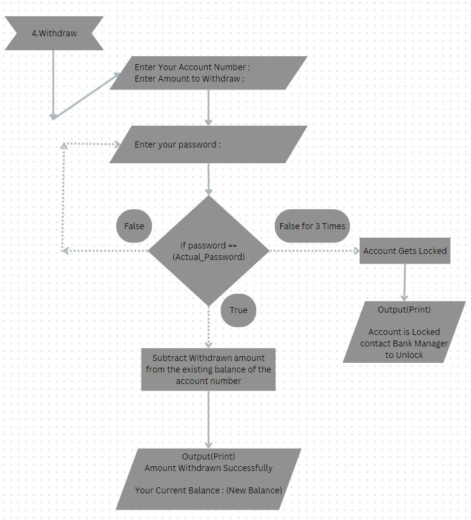
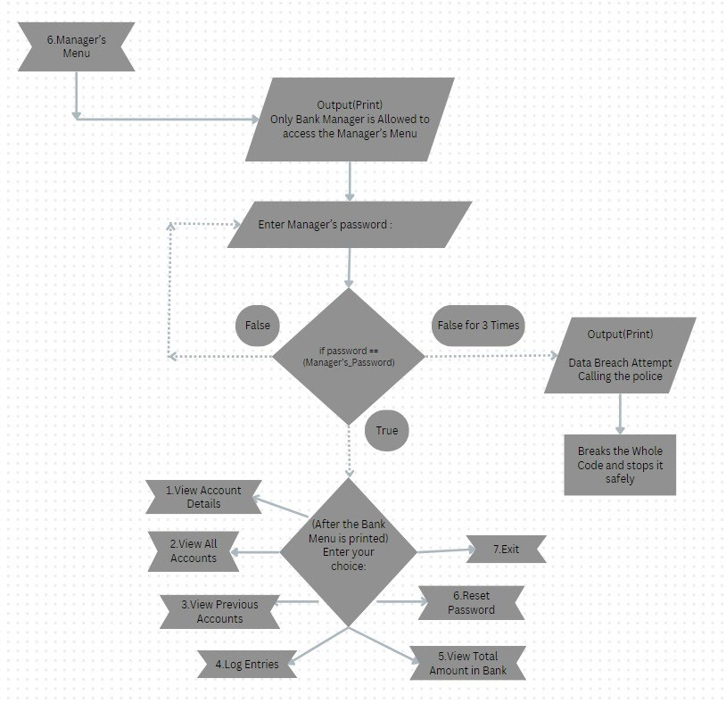

# What Does this Project do?
Phoenix bank management system is a secure platform offering various banking operations. 
Upon launching, you'll encounter the main menu with options ranging from
- creating a new account to 
- managing existing ones, 
- conducting deposits and withdrawals,
- transferring funds, 
- accessing the manager's menu for additional functionalities,
- deleting accounts, and finally, exiting the application.

# Why did i do this?
 project for CBSE 12th IP

This is a very basic Bank Management System 
It took me about 2 weeks to complete the whole thing, and another 1 week to refine the code

# Requirements
--> VScode or Spyder
--> MySQL

for more details look into the attached pdf, i have provided the flowchart of the code and the output
the pdf is more of a readme than this read me document

# Project Flow Chart

# Program Output

(note - dummy values have been used throughout this sample program output)

Login (Establishing Connection)
This part is about SQL,
- Kindly insert the accurate information about your SQL

Main Menu
- Main Menu along with the connection part

Option_1 (To Create an Account)
- If In Case Password isn’t Strong Enough, or It doesn’t meet the requirement

- If Password is Suitable and Strong Enough

Option_2 (To View the Details of an Account)
- When the correct password is entered

- When the Wrong password is entered

Option_3 (To Deposit into an Account)
Note – For Depositing into an Account Password is not required (Unlike Withdrawing from an Account)
- If Account Holder Wishes to Donate to Charity

- If Account Holder Doesn’t want to Donate to Charity

Option_4 (To Withdraw From an Account)
- Withdrawing Amount

- Withdrawing more Amount than balance in bank

- Withdrawing Exactly Total Amount of balance in Bank

Option_5 (To Perform a Bank Transfer from One Account to Another)
- While both senders and receivers account exists and the sender account has sufficient fund

- When senders account number is entered wrongly (same occurs when receivers account number is inserted wrongly)

Option_6 (Manager’s Menu)
A Whole Bunch of Exclusive features for Managing the Bank
- The managers menu, When correct password is entered

- When wrong password is entered for 3 times
It automatically ends the program and proceeds to warn the user that it is about to contact the authorities

Option_1 (Manager’s Menu)
- To view Account Details with Account Specific Log Entries
Here status denotes if the account is locked or not,
(if status is = 0 then it is usable), (if status is = 1 then it is locked)
(The account automatically gets locked when wrong password is entered 3 times)

Option_2 (Manager’s Menu)
- To View All The Existing Account Holders In the Bank

Option_3 (Manager’s Menu)
- To view Past Customers/Account Holders

Option_4 (Manager’s Menu)
- To view All Recorded Log Entries

Option_5 (Manager’s Menu)
To Reset Password for a locked Account or If Account Holder Forgot Password
- If passwords doesn’t match

- If passwords match

Option_6 (Manager’s Menu)
- To Exit Manager’s Menu

Option_7 (Delete an Account)
- The deleted account’s get recorded in the previous account’s table

Option_8 (To Exit Phoenix Bank Management System)

